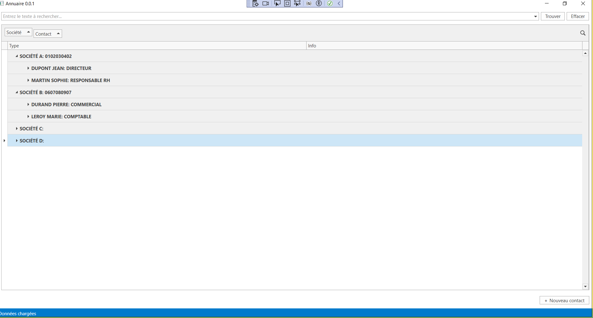
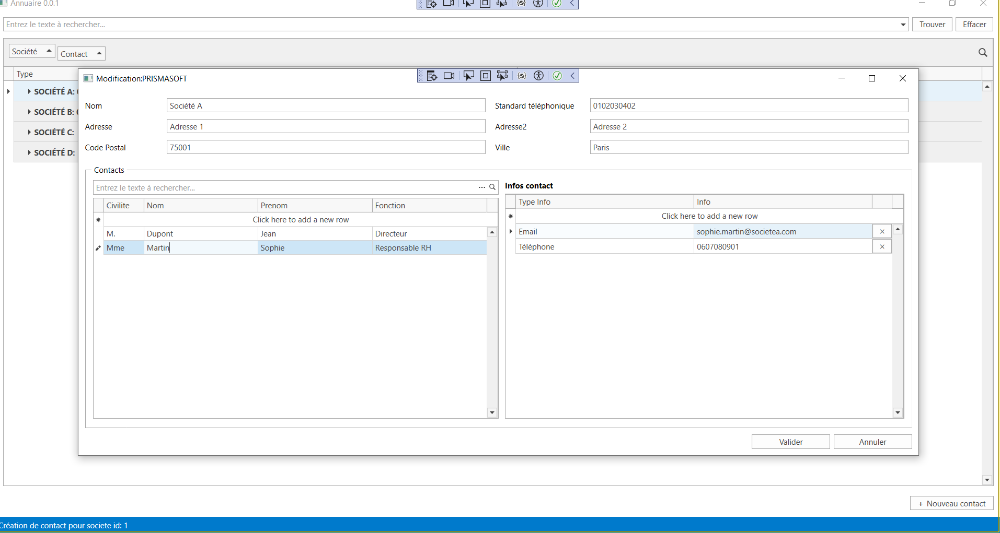

# Annuaire






## Configuration du projet
- Entity Framework Core
- Base : SQLEXPRESS


## Installation
- Création du schéma DB vide dans la console NuGet :
```
Drop-Database
Update-Database
```
- Remplir les tables :
```
executer le script : ./Annuaire.sql
```
  
## Améliorations possibles

On aurait pu faire ajouter des contrôles sur l'UI, faire plus d’encapsulation du code, utiliser des enums par exemple ou utiliser des tables SQL de références et clarifier l’utilisation du passage en paramètre de MainViewModel.


A la place de l’implémentation de la méthode AddContact.Save() qui enregistre les collections séparément, on aurait pu lier le graphe d’objets à l’UI et laisser le binding propager les modifications de l’utilisateur sur le graphe d’objets.


De cette manière, appeler SaveChanges() sur le contexte pour que l’ensemble des modifications  soient enregistrés dans la base est suffisant.
 
## Détail
Pour utiliser le graph d'objets et laisser l'ORM gérer les mises à jour en cascade, il faut :

• Charger l'objet principal (ici la Societe) avec ses enfants (Contacts et InfoContacts) dans le même contexte.  
• Lier directement les contrôles de l'interface aux propriétés de cet objet (et de ses collections) pour que toute modification soit appliquée directement sur le graph.  
• Au moment de la sauvegarde, il suffit d'appeler SaveChanges() sur le contexte, qui détecte alors les ajouts, suppressions ou modifications sur l'ensemble du graph.

Voici un extrait de code montrant comment le constructeur et la méthode Save() auraient pu être codés pour ce scénario :

```csharp
// Exemple dans le ViewModel

// Le graph est chargé depuis la base et lié à l'UI :
public async Task LoadSocieteGraphAsync(int societeId)
{
    using (var context = new AnnuaireDbContext())
    {
        // Charger la société avec ses contacts et infos en cascade
        var societeGraph = await context.Societes
            .Include(s => s.Contacts)
                .ThenInclude(c => c.Infos)
            .FirstOrDefaultAsync(s => s.Id == societeId);

        if (societeGraph != null)
        {
            // Ici, on affecte la référence du graph aux propriétés liées à l'UI.
            SelectedSociete = societeGraph;
            Contacts = new ObservableCollection<Contact>(societeGraph.Contacts);
            // Pour chaque contact, on pourra lier ses InfoContacts à l'UI.
        }
    }
}

[GenerateCommand]
public virtual async void Save()
{
    try
    {
        using (var context = new AnnuaireDbContext())
        {
            // Rattacher le graph modifié (chargé initialement et modifié via le binding)
            context.Societes.Attach(SelectedSociete);
            // Indiquer à EF que l'objet et ses enfants sont modifiés
            context.Entry(SelectedSociete).State = EntityState.Modified;
            foreach (var contact in SelectedSociete.Contacts)
            {
                context.Entry(contact).State = contact.Id == 0 ? EntityState.Added : EntityState.Modified;
                foreach (var info in contact.Infos)
                {
                    context.Entry(info).State = info.Id == 0 ? EntityState.Added : EntityState.Modified;
                }
            }
            await context.SaveChangesAsync();
        }
        RequestClose?.Invoke();
        if (_mainViewModel != null)
        {
            await _mainViewModel.RefreshGrid();
        }
    }
    catch (Exception ex)
    {
        MessageBox.Show($"Erreur lors de la sauvegarde : {ex.Message}", "Erreur", MessageBoxButton.OK, MessageBoxImage.Error);
    }
}
```

**Explications clés :**

- **Chargement du graph :** La méthode LoadSocieteGraphAsync charge la société avec ses contacts et infos via Include/ThenInclude. Les contrôles de l'UI sont liés directement aux propriétés (SelectedSociete, Contacts, etc.).  
- **Mise à jour en cascade :** Les modifications réalisées par l'utilisateur sont directement appliquées sur l'objet SelectedSociete et ses collections.  
- **Attachement et modification :** Au moment de la sauvegarde, on attache le graph au nouveau contexte, on marque les entités modifiées (ou ajoutées) et on appelle SaveChanges.  
- **Cascade gérée par EF :** L'ORM détecte les changements sur l'ensemble du graph et exécute les mises à jour (ou insertions) en cascade.

Cette approche permet d'avoir un graph cohérent et de laisser EF Core synchroniser directement toutes les modifications avec la base.
